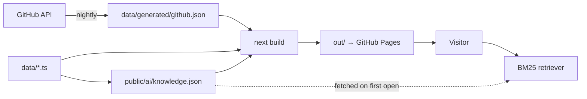

# krishnaannavaram.github.io

Personal site for Krishna Annavaram — Generative AI Engineer. Static Next.js
export, deployed to GitHub Pages.

**Read [`CONTENT_TODO.md`](./CONTENT_TODO.md) first.** Two items in it are
security issues in *other* repositories that should be dealt with regardless of
this site.

---

## Overview

The site's argument is that the strongest evidence a systems engineer has is the
systems themselves, so the spine of it is five repository-backed case studies —
each with real architecture, figures computed against a clone, and a section
stating what the system cannot do.

Three things make it more than a brochure:

- **GitHub is a live data source.** A scheduled job syncs repository metadata
  into a committed snapshot that the build reads.
- **Architecture is typed data**, rendered to accessible DOM rather than shipped
  as an image or a diagram library — theme-aware, reflowing, and marking which
  stages are deterministic and which involve a model.
- **The assistant retrieves and cites; it does not generate.** There is no model
  in its answer path, so it cannot state anything the site does not already say.

## Features

| | |
|---|---|
| Project explorer | Search, domain and language facets over every project and case study |
| Architecture diagrams | Typed `SystemDiagram` data → accessible DOM, with an explicit model boundary |
| GitHub activity | Language mix and recent commits, from a committed snapshot |
| Grounded assistant | BM25 over 97 passages, with citations and a relevance floor that lets it decline |
| Command palette | ⌘K over pages, projects, roles, writing and research |
| Themes | Light and dark, both first-class, resolved before first paint |
| Résumé | One PDF, one path, referenced from a single constant |

## Architecture

See [`docs/ARCHITECTURE.md`](./docs/ARCHITECTURE.md) for the full picture.



No server. No database. No runtime API call.

## Tech stack

| | |
|---|---|
| Framework | Next.js 15 (App Router, `output: 'export'`) |
| UI | React 19 |
| Styling | Tailwind CSS v4 — CSS-first `@theme`, no config file |
| Type | Newsreader · Inter · JetBrains Mono, self-hosted via `next/font` |
| Content | TypeScript data modules + MDX for essays |
| Icons | lucide-react |
| Tests | Vitest + Playwright + axe-core |
| Hosting | GitHub Pages via Actions |

No animation library, no 3D, no charting library, no diagram library, no
client-side AI SDK. Every dependency is justified in the table above.

## Repository structure

```
app/            routes — every page statically generated
components/     architecture · assistant · projects · home · layout · ui
content/        writing/*.mdx
data/           all copy; generated/github.json is synced, never hand-edited
docs/           research, audit, architecture, design system, test report, reviews
lib/            architecture types, assistant retrieval, project join
public/         resume, reports, images, ai/knowledge.json
scripts/        sync, index build, contrast check, static server
tests/          unit/ and e2e/
```

## Local development

```bash
npm install
npm run dev          # http://localhost:3000
npm run build        # prebuild rebuilds the knowledge index, then exports to ./out
npm run typecheck
npm run lint
npm test             # unit
npm run test:e2e     # E2E; builds are NOT automatic — run `npm run build` first
```

## Environment variables

There are none, and that is a design property rather than an omission — no API
key, no token in the client, no `.env`.

Two exist for the build and for CI only:

| Variable | Where | Purpose |
|---|---|---|
| `NEXT_PUBLIC_BASE_PATH` | build | Serve from a subpath instead of the domain root |
| `GITHUB_TOKEN` | Actions only | Raises the API rate limit for the sync job |
| `SYNC_INCLUDE_PRIVATE` | Actions only | Comma-separated private repos to include. **Doing so publishes their names, descriptions and topics into this public repository.** |

## GitHub synchronisation

`.github/workflows/sync-github.yml` runs nightly at 06:17 UTC, on manual
dispatch, and on a `repository_dispatch` of type `project-updated`.

It fetches repository metadata, writes `data/generated/github.json`, rebuilds the
knowledge index, commits both **only if something changed**, and then dispatches
the deploy explicitly — a push made with `GITHUB_TOKEN` does not trigger other
workflows.

Private repositories are excluded by default.

**To update now:** run the workflow from the Actions tab, or locally:

```bash
GITHUB_TOKEN=$(gh auth token) npm run sync:github
npm run knowledge
git commit -am 'chore: sync GitHub project metadata'
```

If the API is unreachable the script exits non-zero and leaves the committed
snapshot untouched, so a GitHub outage cannot produce an empty projects page.

## AI assistant

Opened with the button, ⌘K, or `/`. Never opens itself.

`scripts/build-knowledge-index.mts` reads the same data modules the pages render
and writes `public/ai/knowledge.json` — currently 97 passages, 91 kB, fetched on
first open only. `lib/assistant/retrieval.ts` scores with BM25 plus heading and
keyword boosts, a domain synonym map, and a coverage penalty, then returns
passages **verbatim** with citations. Below the relevance floor it says it does
not know and suggests questions it can answer.

There is no model in the answer path. See `docs/ARCHITECTURE.md` §4 for the
precise scope of that claim, including the one way it can still be unhelpful.

## Content management

Everything the site renders comes from `data/` and `content/`. No copy is
hardcoded in a component.

| To change | Edit |
|---|---|
| A project's narrative, order, or whether it appears | `data/projects.ts` |
| An employment case study | `data/work.ts` |
| A role | `data/experience.ts` |
| Name, positioning, current focus, socials | `data/profile.ts` |
| Skills | `data/skills.ts` |
| Certifications | `data/certifications.ts` |
| Navigation | `data/nav.ts` |
| An essay | drop an `.mdx` file into `content/writing/` |

Adding a project to `data/projects.ts` with `status: 'featured'` puts it on the
home page, in the explorer, in the sitemap, in the ⌘K palette and in the
assistant's index — no other edit needed.

### Updating the résumé

Replace `public/resume/resume.pdf`. The path is referenced once, as
`profile.resumeUrl`.

The résumé is the **source of truth for every claim on the site**. After
replacing it, reconcile `data/experience.ts`, `data/work.ts` and
`data/skills.ts` against it, then `npm run knowledge` so the assistant matches.

### Updating photos

`public/images/profile/portrait.jpg` is the only image. Replace in place, keeping
the portrait aspect ratio.

## Testing

```bash
npm test                              # 58 unit tests
npm run build && npm run test:e2e     # 210 E2E across 5 browser/device profiles
node scripts/check-contrast.mjs       # WCAG AA over the design tokens
```

Unit tests cover the retriever (tokenisation, synonym expansion, the refusal
floor, determinism, index integrity), the project registry join, and the
provenance rules — including tests that fail the build if a published figure has
no stated method, if a case study has no limitations section, or if a figure the
source repository disowns gets published anyway.

E2E covers the visitor flows, accessibility on all ten routes in both themes,
keyboard navigation, no-JavaScript rendering, and behaviour with GitHub
unreachable. See [`docs/TEST_REPORT.md`](./docs/TEST_REPORT.md).

## Deployment

Pushing to `main` runs `.github/workflows/deploy.yml`: typecheck → lint →
contrast → unit → build → E2E on Chromium and WebKit → publish `out/` to Pages.
Pull requests run the same verification without deploying.

To host under a subpath, set `NEXT_PUBLIC_BASE_PATH`.

## Security

No secrets exist. The only user input is the assistant query, which is tokenised
and never evaluated, rendered as HTML, or transmitted. No third-party JavaScript,
no analytics, fonts self-hosted. `dangerouslySetInnerHTML` appears only for
JSON-LD built from typed data. Full posture in `docs/ARCHITECTURE.md` §7.

## Performance

Fully static, self-hosted fonts, no client-side data fetching on load. The
assistant index is the only deferred fetch and only on first open. Figures in
`docs/TEST_REPORT.md`.

## Accessibility

WCAG 2.1 AA is the target and the contrast half of it is enforced in CI. Every
foreground clears 4.5:1 in both themes; headings descend without skipping;
content renders without JavaScript; reduced motion is honoured. Commitments and
known gaps in `docs/DESIGN_SYSTEM.md` §7 and `docs/TEST_REPORT.md`.

## Troubleshooting

| Symptom | Cause |
|---|---|
| Assistant says the index didn't load | `public/ai/knowledge.json` missing — run `npm run knowledge` |
| Projects page shows no GitHub metadata | `data/generated/github.json` missing or the repo name in `data/projects.ts` does not match. The page still renders |
| "Synced N days ago" looks stale | The nightly workflow has not run. Dispatch it from the Actions tab |
| E2E fails immediately | `out/` is stale or absent — run `npm run build` first |
| Contrast check fails | A token was changed. The script prints every failing pair and its ratio |
| A project is missing from the site | Check `status` in `data/projects.ts`. Several repos are deliberately hidden; `CONTENT_TODO.md` says why |

## Documentation

| | |
|---|---|
| [`docs/PORTFOLIO_RESEARCH.md`](./docs/PORTFOLIO_RESEARCH.md) | What top engineering portfolios do, from six real sites |
| [`docs/CURRENT_PORTFOLIO_AUDIT.md`](./docs/CURRENT_PORTFOLIO_AUDIT.md) | Audit of the previous version |
| [`docs/ARCHITECTURE.md`](./docs/ARCHITECTURE.md) | System design, sync pipeline, assistant, limitations |
| [`docs/DESIGN_SYSTEM.md`](./docs/DESIGN_SYSTEM.md) | Colour, type, layout, motion, components |
| [`docs/TEST_REPORT.md`](./docs/TEST_REPORT.md) | What was tested, what was found, what is not covered |
| [`docs/PORTFOLIO_CRITIQUE.md`](./docs/PORTFOLIO_CRITIQUE.md) | Independent review findings |
| [`docs/FINAL_PORTFOLIO_REVIEW.md`](./docs/FINAL_PORTFOLIO_REVIEW.md) | Before/after scoring |
