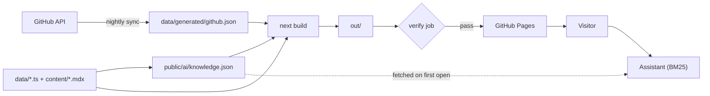
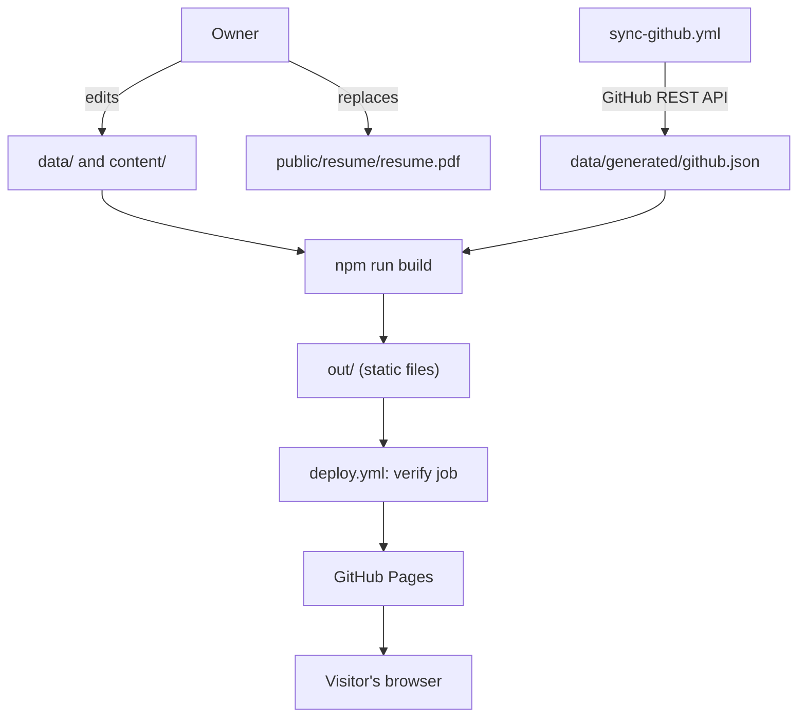
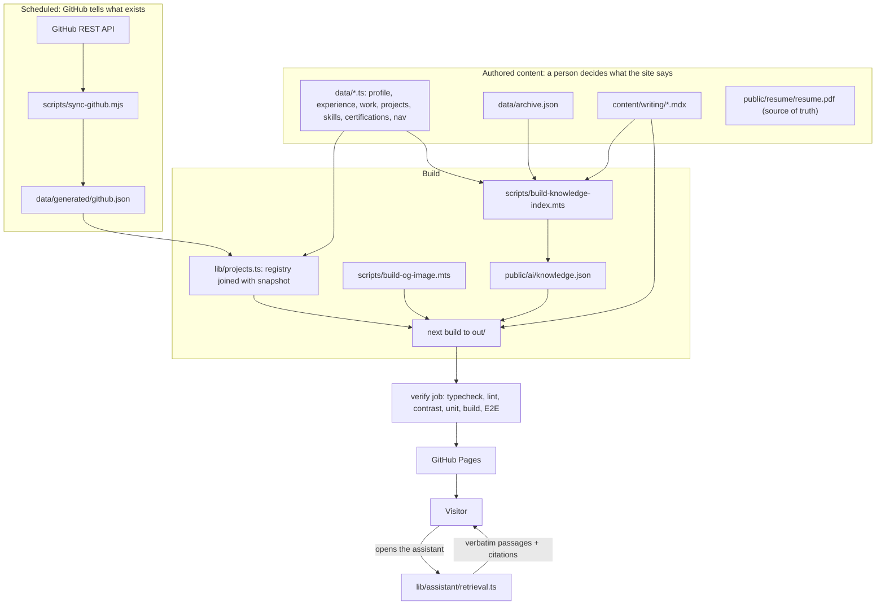
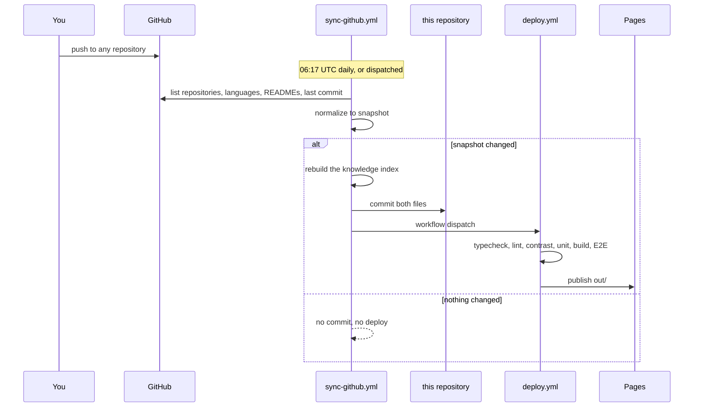
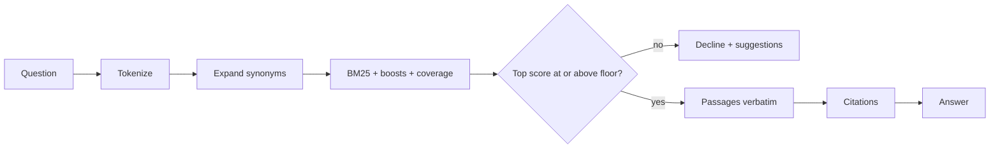

<div align="center">

# KrishnaAnnavaram.github.io — Personal Portfolio Site of Krishna Annavaram, Generative AI Engineer

**KrishnaAnnavaram.github.io is a static Next.js portfolio site. It takes authored data, the résumé and a committed GitHub snapshot through these steps to a tested site on GitHub Pages:**

`sync GitHub metadata` → `join with the registry` → `build the knowledge index` → `export static pages` → `verify` → `deploy to GitHub Pages`.


**[Summary](#1-summary)** ·
**[Workflow](#4-the-end-to-end-workflow)** ·
**[Assistant](#9-the-grounded-assistant)** ·
**[Run the site](#15-how-to-run-the-site)** ·
**[Known problems](#18-known-problems)** ·
**[Glossary](#20-glossary)**

</div>

> [!NOTE]
> This README uses ASD-STE100 Simplified Technical English. The writing rules and the project
> vocabulary are in [`docs/ste-style-guide.md`](docs/ste-style-guide.md). Each term in the
> [Glossary](#20-glossary) has only one meaning.

> [!WARNING]
> Do not add a private repository to `SYNC_INCLUDE_PRIVATE` unless you accept that its name, description and topics become public.
> The sync commits the snapshot to this public repository.

---

This repository holds the personal site of Krishna Annavaram, Generative AI Engineer.
The site is a static Next.js export that GitHub Pages serves. There is no server, no database and no runtime API call.
The site argues that the strongest evidence of a systems engineer is the systems themselves.
Thus, its center is six repository-backed case studies, led by MARS and Bootshift.
Each case study has a real architecture, figures with a stated method, and a section that states what the system cannot do.

Three properties make the site more than a brochure:

- **GitHub is a live data source.** A scheduled job syncs repository metadata into a committed snapshot that the build reads.
- **Architecture is typed data.** The site renders each diagram to accessible HTML. Each diagram marks which stages are deterministic and which stages use a model.
- **The assistant retrieves and cites. It does not generate.** There is no model in its answer path, so it cannot state a fact that the site does not already state.

**Read [`CONTENT_TODO.md`](./CONTENT_TODO.md) first.** Some items in it are security problems in *other* repositories of the owner. These problems need action, independent of this site.

This README describes the `redesign/ai-portfolio-2026` branch. It is the **one location that explains all of the site**. It gives these topics:

- the general design and the design rules
- each page, each home page section and each data module
- the GitHub sync, the architecture diagrams and the assistant
- the tests, the deployment and the data map
- the runbook, the validation results and the known problems

| If you are… | Read |
|---|---|
| A manager or reviewer | [1](#1-summary), [3](#3-design-rules), [4](#4-the-end-to-end-workflow), [17](#17-validation-results), [19](#19-key-points) |
| A developer who joins the project | All sections, in sequence. Keep [15](#15-how-to-run-the-site), [16](#16-how-to-extend-the-site) and [18](#18-known-problems) open while you work |
| The owner who updates the content | [10](#10-content-management), then [7](#7-the-project-registry-and-the-github-snapshot) and [12](#12-deployment-through-github-pages) |

---

## Table of contents

1. 🧭 [Summary](#1-summary)
2. 🏗️ [How the site is built](#2-how-the-site-is-built)
   - 2.1 [Components](#21-components) · 2.2 [System context](#22-system-context) · 2.3 [Repository layout](#23-repository-layout) · 2.4 [Tech stack](#24-tech-stack)
3. 🛡️ [Design rules](#3-design-rules)
4. 🔄 [The end-to-end workflow](#4-the-end-to-end-workflow)
   - 4.1 [Full flow](#41-full-flow) · 4.2 [The life cycle of one repository update](#42-the-life-cycle-of-one-repository-update)
5. 🗺️ [Pages and routes](#5-pages-and-routes)
6. 🏠 [The home page and the site features](#6-the-home-page-and-the-site-features)
7. 🔵 [The project registry and the GitHub snapshot](#7-the-project-registry-and-the-github-snapshot)
8. 🟢 [Architecture diagrams and charts](#8-architecture-diagrams-and-charts)
9. 🟣 [The grounded assistant](#9-the-grounded-assistant)
10. ✏️ [Content management](#10-content-management)
    - 10.1 [Where each item lives](#101-where-each-item-lives) · 10.2 [Update the résumé](#102-update-the-résumé) · 10.3 [Update the photos](#103-update-the-photos)
11. 🧪 [Tests and quality gates](#11-tests-and-quality-gates)
12. 🚀 [Deployment through GitHub Pages](#12-deployment-through-github-pages)
13. 🔒 [Security, performance and accessibility](#13-security-performance-and-accessibility)
14. 🗂️ [Data and file map](#14-data-and-file-map)
15. ▶️ [How to run the site](#15-how-to-run-the-site)
    - 15.1 [Prerequisites](#151-prerequisites) · 15.2 [Installation](#152-installation) · 15.3 [Run the site](#153-run-the-site) · 15.4 [Environment variables](#154-environment-variables) · 15.5 [Symptoms and causes](#155-symptoms-and-causes)
16. 🧩 [How to extend the site](#16-how-to-extend-the-site)
17. ✅ [Validation results](#17-validation-results)
18. ⚠️ [Known problems](#18-known-problems)
19. 📌 [Key points](#19-key-points)
20. 📖 [Glossary](#20-glossary)
21. 📄 [License](#21-license)

---

## 1. Summary

**The problem.** A portfolio site usually makes claims that a reader cannot check. These questions are difficult:

- How can the site show real systems, and not only descriptions of them?
- How can the site stay current with GitHub without a server or a runtime API call?
- How can an assistant answer questions about the owner and never invent a fact?
- How can each published figure show where it came from?
- How can each change be tested before it goes live?

The site gives each of these questions its own mechanism. Each mechanism has a test.

| Item | Value |
|---|---|
| Site type | Static Next.js 15 export (`output: 'export'`). No server, no database, no runtime API call |
| Input | Authored data in `data/` and `content/`, the résumé PDF and the committed GitHub snapshot |
| Output | **27** static pages in `out/`, published to GitHub Pages at `https://krishnaannavaram.github.io` |
| Flagship systems | **6**: MARS, Semantic MCP Data Access Gateway, Bootshift, Statute, Adaptive Legacy Complexity Harness, DecisionForge |
| Employment case studies | **4** in `data/work.ts` |
| Roles | **5** in `data/experience.ts` |
| Archive | **75** earlier repositories in 13 categories, with no model metrics |
| Writing | **2** MDX essays in `content/writing/` |
| GitHub snapshot | **94** repositories, last synced 2026-10-07 |
| Assistant | BM25 retrieval over **119** passages, with citations. No model in the answer path |
| Tests | **89** unit tests (Vitest), **345** E2E tests (Playwright, 69 for each of 5 browser profiles), WCAG contrast check |
| Deployment | GitHub Actions. The `verify` job runs first. The `deploy` job runs only after a push to `main` or a manual dispatch |


```mermaid
flowchart LR
    GH["GitHub API"] -->|nightly sync| SNAP["data/generated/github.json"]
    DATA["data/*.ts + content/*.mdx"] --> KB["public/ai/knowledge.json"]
    SNAP --> BUILD["next build"]
    DATA --> BUILD
    KB --> BUILD
    BUILD --> OUT["out/"]
    OUT --> VERIFY{"verify job"}
    VERIFY -->|pass| PAGES["GitHub Pages"]
    PAGES --> USER["Visitor"]
    KB -.->|fetched on first open| ASSIST["Assistant (BM25)"]
    USER --> ASSIST
```

No server. No database. No runtime API call.

---

## 2. How the site is built

### 2.1 Components

| Component | Location | Purpose |
|---|---|---|
| Routes | `app/` | Every page is statically generated. `layout.tsx` loads the fonts, the theme script and the header and footer |
| Home sections | `components/home/` | Hero, trust strip, flagship bento, impact at work, run history, earlier work, approach, contact call to action |
| Architecture diagram | `components/architecture/SystemDiagram.tsx`, `lib/architecture.ts` | Typed diagram data to accessible HTML, with node kinds that mark the model boundary |
| Charts | `components/charts/` | `StageBar` (composition bar) and `ModelBoundaryChart` ("Where the model sits") |
| Assistant | `components/assistant/`, `lib/assistant/` | Provider, Ask button, dialog, BM25 retriever and its types |
| Project views | `components/projects/` | `ProjectExplorer`, `ArchiveExplorer`, `GitHubActivity` |
| Layout | `components/layout/` | `Header`, `Footer`, `ThemeToggle`, `CommandPalette` |
| UI parts | `components/ui/` | `Logo`, `PageHeader`, `Reveal`, `Spotlight`, MDX components, small parts in `Bits.tsx` |
| Project join | `lib/projects.ts` | Joins the registry with the snapshot. Gives the activity summary and the explorer feed |
| Writing loader | `lib/writing.ts` | Reads the front matter of the MDX essays with `gray-matter` |
| Palette index | `lib/palette.ts` | Builds the command palette entries on the server: pages, projects, case studies, roles, writing and archive |
| Data modules | `data/` | All copy that the site renders |
| Scripts | `scripts/` | Sync, knowledge index, Open Graph card, contrast check, static server |
| Workflows | `.github/workflows/` | `deploy.yml` (verify and deploy) and `sync-github.yml` (nightly sync) |

### 2.2 System context


```mermaid
flowchart TB
    OWNER["Owner"] -->|edits| DATA["data/ and content/"]
    OWNER -->|replaces| RESUME["public/resume/resume.pdf"]
    CRON["sync-github.yml"] -->|GitHub REST API| SNAP["data/generated/github.json"]
    DATA --> BUILD["npm run build"]
    SNAP --> BUILD
    BUILD --> OUT["out/ (static files)"]
    OUT --> CI["deploy.yml: verify job"]
    CI --> PAGES["GitHub Pages"]
    PAGES --> VISITOR["Visitor's browser"]
```

### 2.3 Repository layout

```
KrishnaAnnavaram.github.io/
├── .github/workflows/
│   ├── deploy.yml           # verify job (typecheck, lint, contrast, index, unit, build, E2E), then deploy job
│   └── sync-github.yml      # nightly GitHub sync, commit if changed, dispatch deploy
├── app/                     # routes, every page is statically generated
│   ├── projects/            # explorer, archive and project case studies
│   ├── work/                # employment case studies
│   ├── experience/  writing/  about/  contact/
│   └── layout.tsx  page.tsx  not-found.tsx  robots.ts  sitemap.ts  globals.css
├── components/              # architecture · assistant · charts · home · layout · projects · ui
├── content/writing/         # 2 MDX essays
├── data/                    # all copy, generated/github.json is synced and never edited by hand
├── docs/                    # research, audit, architecture, design system, test report, reviews, redesign, STE guide
├── lib/                     # architecture types, assistant retrieval, project join, palette, writing
├── portfolio_data/          # source documents and photos (not read by the build)
├── public/                  # resume/, images/profile/, ai/knowledge.json, og.png, manifest.json, .nojekyll
├── scripts/                 # sync, index build, OG card, contrast check, static server
├── tests/
│   ├── unit/                # retrieval, registry and provenance, secrets in out/
│   └── e2e/                 # visitor flows, responsive, accessibility, contrast and performance probes
├── CONTENT_TODO.md          # open content and security items for the owner
├── next.config.mjs  playwright.config.ts  vitest.config.ts  tsconfig.json  postcss.config.mjs
└── package.json  package-lock.json  LICENSE
```

### 2.4 Tech stack

| Area | Choice |
|---|---|
| Framework | Next.js 15 (App Router, `output: 'export'`, `trailingSlash: true`, `images.unoptimized`) |
| UI | React 19 |
| Styles | Tailwind CSS v4: CSS-first `@theme`, no config file |
| Type | Inter for all text, JetBrains Mono for identifiers only, self-hosted through `next/font` |
| Content | TypeScript data modules and MDX for essays (`@next/mdx`, `next-mdx-remote`, `gray-matter`, `remark-gfm`) |
| Icons | `lucide-react` |
| Tests | Vitest, Playwright and `@axe-core/playwright` |
| Host | GitHub Pages, published by GitHub Actions |

The site has no animation library, no 3D, no chart library, no diagram library and no client-side AI SDK.
Each dependency has a purpose in the table above.

---

## 3. Design rules

### 3.1 No content crosses a network at request time
The build reads the committed snapshot and the data modules. The pages make no API call. A GitHub outage cannot break a deploy, because the build reads the last good snapshot. The only deferred fetch is the knowledge index, and only when a visitor opens the assistant.

### 3.2 GitHub tells what exists. The registry tells what the site shows
The snapshot holds repository metadata. The registry, `data/projects.ts`, holds the narrative and the decision to show a project. A repository with no registry entry is never shown. A project whose repository disappears still renders, without live metadata. Tests in `tests/unit/projects.test.ts` enforce both rules.

### 3.3 The assistant retrieves and cites. It does not generate
The answer is a lead sentence from a fixed set of templates, the retrieved passages verbatim, and their source links. No model is in the path. The assistant cannot state a fact that is not written on the site.

### 3.4 Each fact has one source
The pages and the knowledge index read the same data modules. The résumé is the source of truth for each claim. No copy is hard-coded in a component.

### 3.5 Each figure states its method
Each published figure records how it was obtained. Each case study states what the system cannot do. Each employment case study names the source of its figures. The unit tests fail the build if one of these rules breaks.

### 3.6 The diagrams mark the model boundary
Each diagram node has a kind. The kinds show which stages are deterministic code, which stages are model or agent calls, and which stages are human gates. Each diagram must mark at least one deterministic stage.

### 3.7 The tested files are the shipped files
The E2E suite runs against the static export in `out/`, not against a dev server. CI rebuilds the knowledge index before the unit tests, so the tests check the index that ships.

### 3.8 No secrets
The site has no API key and no token in the client. Private repositories stay out of the snapshot by default.

---

## 4. The end-to-end workflow

### 4.1 Full flow


```mermaid
flowchart TB
    subgraph authored["Authored content: a person decides what the site says"]
        DATA["data/*.ts: profile, experience, work, projects, skills, certifications, nav"]
        ARCH["data/archive.json"]
        MDX["content/writing/*.mdx"]
        RESUME["public/resume/resume.pdf (source of truth)"]
    end
    subgraph sync["Scheduled: GitHub tells what exists"]
        GH["GitHub REST API"] --> SYNC["scripts/sync-github.mjs"] --> SNAP["data/generated/github.json"]
    end
    subgraph build["Build"]
        MERGE["lib/projects.ts: registry joined with snapshot"]
        INDEX["scripts/build-knowledge-index.mts"]
        OG["scripts/build-og-image.mts"]
        KB["public/ai/knowledge.json"]
        NEXT["next build to out/"]
    end
    DATA --> MERGE
    SNAP --> MERGE
    MERGE --> NEXT
    DATA --> INDEX
    ARCH --> INDEX
    MDX --> INDEX
    MDX --> NEXT
    INDEX --> KB --> NEXT
    OG --> NEXT
    NEXT --> VERIFY["verify job: typecheck, lint, contrast, unit, build, E2E"]
    VERIFY --> PAGES["GitHub Pages"]
    PAGES --> VISITOR["Visitor"]
    VISITOR -->|opens the assistant| ASSIST["lib/assistant/retrieval.ts"]
    ASSIST -->|verbatim passages + citations| VISITOR
```

### 4.2 The life cycle of one repository update

1. The owner pushes to any repository on GitHub.
2. At 06:17 UTC, or on a manual or `repository_dispatch` trigger, `sync-github.yml` starts.
3. `scripts/sync-github.mjs` lists the repositories and gets the languages, the README and the last commit of each repository.
4. The script normalizes the data and compares it with the committed snapshot. It ignores `syncedAt`.
5. If nothing changed, the job stops. There is no commit and no deploy.
6. If the snapshot changed, the job rebuilds the knowledge index and commits both files.
7. The job dispatches `deploy.yml`, because a push with `GITHUB_TOKEN` does not start other workflows.
8. The `verify` job runs the typecheck, the lint, the contrast check, the unit tests, the build and the E2E tests.
9. The `deploy` job publishes `out/` to GitHub Pages.


```mermaid
sequenceDiagram
    participant You
    participant GH as GitHub
    participant Cron as sync-github.yml
    participant Repo as this repository
    participant Deploy as deploy.yml
    participant Pages
    You->>GH: push to any repository
    Note over Cron: 06:17 UTC daily, or dispatched
    Cron->>GH: list repositories, languages, READMEs, last commit
    Cron->>Cron: normalize to snapshot
    alt snapshot changed
        Cron->>Cron: rebuild the knowledge index
        Cron->>Repo: commit both files
        Cron->>Deploy: workflow dispatch
        Deploy->>Deploy: typecheck, lint, contrast, unit, build, E2E
        Deploy->>Pages: publish out/
    else nothing changed
        Cron-->>Cron: no commit, no deploy
    end
```

---

## 5. Pages and routes

The build makes 27 static pages. Each folder under `app/` is one route.

| Route | Source | Contents |
|---|---|---|
| `/` | `app/page.tsx` | The home page sections (see [Section 6](#6-the-home-page-and-the-site-features)) and Person and ItemList JSON-LD |
| `/projects/` | `app/projects/page.tsx` | Project explorer, GitHub activity and the archive with search and filters |
| `/projects/<slug>/` | `app/projects/[slug]/page.tsx` | 6 project case studies: problem, constraints, approach, diagram, decisions, evidence, limitations, provenance |
| `/work/` | `app/work/page.tsx` | Index of the employment case studies |
| `/work/<slug>/` | `app/work/[slug]/page.tsx` | 4 employment case studies |
| `/experience/` | `app/experience/page.tsx` | Roles, dates and education |
| `/writing/` | `app/writing/page.tsx` | Index of the essays |
| `/writing/<slug>/` | `app/writing/[slug]/page.tsx` | 2 MDX essays |
| `/about/` | `app/about/page.tsx` | Background, principles, skills, certifications and the three portraits |
| `/contact/` | `app/contact/page.tsx` | Email, LinkedIn, GitHub, résumé and a contact form that composes a `mailto:` link |
| `/robots.txt`, `/sitemap.xml` | `app/robots.ts`, `app/sitemap.ts` | Crawler files |
| 404 | `app/not-found.tsx` | The not-found page |
| `/icon.svg`, `/apple-icon.png`, `/og.png` | `app/`, `public/` | KA monogram icons and the Open Graph card |

The header has five navigation items from `data/nav.ts`: Projects, Experience, Writing, About and Contact.

---

## 6. The home page and the site features

The home page shows these sections, in this sequence:

| # | Section | Component | Contents |
|---|---|---|---|
| 1 | Hero | `Hero.tsx`, `RotatingPortrait.tsx` | Portrait, name, role, location, one sentence and three links |
| 2 | Trust strip | `TrustStrip.tsx` | Figures that the site computes from its own data. They are not typed in |
| 3 | Flagship bento | `SystemsBento.tsx` | The six flagship systems. Each tile has a composition bar. Below the tiles is the "Where the model sits" chart |
| 4 | Impact at work | `ImpactAtWork.tsx` | Production work at each employer, with the résumé outcomes as stat tiles |
| 5 | Run history | `RunHistory.tsx` | The roles as a run log, newest first. Each role is a native `<details>` element |
| 6 | Earlier work | `EarlierWork.tsx` | Category counts and six archive entries, then a link to the full archive |
| 7 | Approach | `Approach.tsx` | How the owner works |
| 8 | Contact | `ContactCTA.tsx` | The call to action |

These features are on the home page or on all pages:

| Feature | What it does |
|---|---|
| Flagship bento | Six tiles. Each tile has a composition bar from its architecture diagram: stages split by script, model or agent, human gate, and data |
| Impact at work | Stat tiles, not a chart, because each figure measures a different thing |
| Where the model sits | One chart that compares the stages of each flagship by who decides. It has hover tooltips and a table view |
| Portrait rotation | Three photos, one for each 7-minute wall-clock slot. The site selects the photo before first paint. It has a crossfade and Next and Pause controls |
| Project explorer | Search, domain filters and language filters over each project and case study |
| Archive | 75 applied ML and GenAI repositories. Search, a category filter and an LLM filter, synced to the URL (`?q=` and `?category=`). No model metrics |
| Architecture diagrams | Typed `SystemDiagram` data to accessible HTML, with an explicit model boundary |
| GitHub activity | Language mix as a sorted bar chart, and recent commits, from the committed snapshot |
| Grounded assistant | BM25 over 119 passages, with citations, and a relevance floor that lets it decline |
| Command palette | ⌘K (or Ctrl+K) over pages, projects, case studies, roles, writing and the archive |
| Themes | Light and dark. The theme is resolved before first paint |
| Résumé | One PDF at one path, referenced from one constant |

---

## 7. The project registry and the GitHub snapshot

**Purpose.** Show live repository metadata, and keep a person in control of what the site says.

| Layer | Owns | Location |
|---|---|---|
| **Snapshot** | What exists: names, languages, topics, stars, push dates, READMEs, last commit | `data/generated/github.json` (generated) |
| **Registry** | What the site says: which projects appear, in what order, with what narrative and which measured figures | `data/projects.ts` (authored) |

**Join rules** (`lib/projects.ts`)

- A project whose repository disappears still renders. It loses the live metadata and keeps its case study.
- A repository with no registry entry is never shown. GitHub cannot publish to the site on its own.
- DecisionForge is private, so its registry entry has no `repo` link.

**Procedure of the sync** (`scripts/sync-github.mjs`)

1. Read `SYNC_USER` (default `KrishnaAnnavaram`) and `GITHUB_TOKEN` or `GH_TOKEN`.
2. List the repositories in pages of 100, for a maximum of 10 pages. Keep only the repositories of the owner.
3. Remove each private repository that is not in `SYNC_INCLUDE_PRIVATE`. Record its name in `skippedPrivate`.
4. For each repository, get the languages, the raw README and the last commit.
5. Keep the README body and its mermaid blocks only for registry repositories.
6. Keep only the lead paragraph for archive repositories. Keep no README text for other repositories.
7. If no repository is described, stop with an error. The script does not write an empty snapshot.
8. Compare the new snapshot with the old one, without `syncedAt`. Write the file only if it changed.
9. Write `changed=true` or `changed=false` to `GITHUB_OUTPUT` for the workflow.

**Rules**

- Without a token, the script uses the public endpoint (60 requests each hour). With a token, it uses the authenticated endpoint (5,000 requests each hour).
- If the API is not available, the script exits with a non-zero code. The committed snapshot does not change, so a GitHub outage cannot make an empty projects page.
- `sync-github.yml` runs at 06:17 UTC each day, on a manual dispatch, and on a `repository_dispatch` of type `project-updated`.
- The workflow commits with the message `chore: sync GitHub project metadata [skip ci]` and then dispatches `deploy.yml`.

**Update the snapshot now.** Run the *Sync GitHub projects* workflow from the Actions tab, or run these commands:

```bash
GITHUB_TOKEN=$(gh auth token) npm run sync:github
npm run knowledge
git commit -am 'chore: sync GitHub project metadata'
```

---

## 8. Architecture diagrams and charts

**Purpose.** Show where the model boundary of each system is, as data and not as an image.

A `SystemDiagram` (`lib/architecture.ts`) has groups. Each group has nodes. Each node has a kind:

| Node kind | Meaning |
|---|---|
| `source` | External input that the system does not control |
| `deterministic` | Deterministic code. Same input, same output, no model |
| `model` | A model call, the non-deterministic part of the system |
| `agent` | An autonomous agent that decides when and how to act |
| `human` | A person: an approval or a review that the system cannot complete alone |
| `store` | Persistent state: a database, an index, a cache or a ledger |
| `output` | What the system gives back |

The charts group the node kinds into four stage categories, in a fixed order. The colour comes from this order and does not cycle.

| Category | Node kinds | Meaning |
|---|---|---|
| Script | `deterministic` | Deterministic code |
| Model or agent | `model`, `agent` | A language model decides |
| Human gate | `human` | A person must approve |
| Data and I/O | `source`, `store`, `output` | Inputs, stores and outputs |

**Rules**

- `SystemDiagram` renders the diagram as theme-aware HTML that reflows. It is not an image.
- `diagramToProse` changes a diagram into text for the knowledge index.
- The four-colour chart palette was validated in both themes.
- The unit tests check that node ids are unique, that each kind is known and that each diagram marks a deterministic stage.

---

## 9. The grounded assistant

**Purpose.** Answer questions about the owner with passages from the site, and decline when no passage is relevant.

Open the assistant with the Ask button or the `/` key. It never opens without an action of the visitor.

| Input | Output |
|---|---|
| A question in free text | A lead sentence from a fixed template, the passages verbatim and a citation for each passage, or a decline with suggested questions |

**Procedure of the index build** (`scripts/build-knowledge-index.mts`)

1. Read the data modules that the pages render: profile, experience, work, projects, skills and certifications.
2. Read the MDX essays and the archive.
3. Change each diagram into text with `diagramToProse`.
4. Make one passage for each item. Drop each passage that has fewer than 40 characters.
5. Write `public/ai/knowledge.json` with the passages and 8 suggested questions.

| Passage source | Passages |
|---|---|
| Projects (flagship systems and archive) | 71 |
| Employment case studies | 20 |
| Experience | 10 |
| Profile | 7 |
| Skills | 7 |
| Writing | 2 |
| Education | 1 |
| Contact | 1 |
| **Total** | **119** |

**Procedure of an answer** (`lib/assistant/retrieval.ts`)

1. Tokenize the question: remove diacritics and stop words, apply a light stemmer.
2. Expand the tokens with a domain synonym map.
3. Score each passage with BM25 (`K1 = 1.4`, `B = 0.72`), plus heading and keyword boosts.
4. Multiply the score by `coverage ^ 0.9`, where coverage is the fraction of the question terms that the passage matches.
5. If the top score is below the relevance floor (`SCORE_FLOOR = 2.0`), decline and show suggested questions.
6. Otherwise, return the passages verbatim and attach the citations.


```mermaid
flowchart LR
    Q["Question"] --> T["Tokenize"] --> E["Expand synonyms"] --> S["BM25 + boosts + coverage"]
    S --> F{"Top score at or above floor?"}
    F -->|no| R["Decline + suggestions"]
    F -->|yes| P["Passages verbatim"] --> C["Citations"] --> A["Answer"]
```

**Rules**

- The browser fetches the index (about 120 kB) only when a visitor opens the assistant. A visitor who does not use the assistant does not download it.
- The coverage exponent stops one rare term from making a match alone. Before this rule, a question about hourly rates matched a passage on the word "per" alone.
- The assistant can be wrong in one way: it can retrieve a passage that does not answer the question. The reader sees this, because the passage and its source are on the screen.
- The index contains no phone number. A unit test asserts this.

See [`docs/ARCHITECTURE.md`](./docs/ARCHITECTURE.md) §4 for the exact scope of the claim that the assistant is grounded.

---

## 10. Content management

### 10.1 Where each item lives

Everything that the site renders comes from `data/` and `content/`.

| To change | Edit |
|---|---|
| The narrative, the order or the visibility of a project | `data/projects.ts` |
| An employment case study | `data/work.ts` |
| A role | `data/experience.ts` |
| Name, positioning, current focus, socials, photos | `data/profile.ts` |
| Skills | `data/skills.ts` |
| Certifications | `data/certifications.ts` |
| Navigation | `data/nav.ts` |
| An archive entry | `data/archive.json` |
| An essay | Add an `.mdx` file to `content/writing/` |

Add a project to `data/projects.ts` with `status: 'featured'` to show it in all locations.
The project then appears on the home page, in the explorer, the sitemap, the ⌘K palette and the knowledge index.
No other edit is necessary.

### 10.2 Update the résumé

1. Replace `public/resume/resume.pdf`. The site references the path one time, as `profile.resumeUrl`.
2. Compare `data/experience.ts`, `data/work.ts` and `data/skills.ts` with the new résumé. Correct each difference.
3. Run `npm run knowledge`, so that the assistant agrees with the pages.

The résumé is the **source of truth for each claim on the site**.

### 10.3 Update the photos

The hero shows the photos in `profile.photos` (`data/profile.ts`), one for each `PHOTO_ROTATION_MS` (7 minutes) of wall-clock time.
Each entry points to two files in `public/images/profile/`: `<name>.webp` and `<name>.jpg`, both 800×1000 (4:5).

1. Export the photo in both formats at 800×1000.
2. Put the two files in `public/images/profile/`.
3. Add an entry to `profile.photos` with real alt text.
4. Build the site again.

The first entry is the default for the social card (`npm run og`), the structured data and the render without JavaScript.

The source photos are in `profile pictures/`. Git ignores this folder on purpose, because the originals include a licence plate that is not blurred. Only the processed, cropped copies are published.

---

## 11. Tests and quality gates

| Suite | Count | Command |
|---|---|---|
| Unit (Vitest, jsdom) | **89** in 3 files | `npm test` |
| End-to-end and accessibility (Playwright) | **345**: 69 tests × 5 profiles | `npm run build && npm run test:e2e` |
| Colour contrast (WCAG AA over the design tokens) | All foreground and background pairs, both themes | `node scripts/check-contrast.mjs` |
| Typecheck | — | `npm run typecheck` |
| Lint | — | `npm run lint` |

**Unit tests** (`tests/unit/`)

| File | What it asserts |
|---|---|
| `retrieval.test.ts` | Tokenization, stemmer idempotence, synonym expansion, the decline for out-of-scope questions, labels for lexical coincidences, fixed lead templates, determinism, index integrity, index size below 400 kB, no phone number |
| `projects.test.ts` | The registry join, provenance rules (each figure has a method, each case study has limitations), archive entries without metrics, diagram integrity |
| `secrets.test.ts` | No phone number, API key, token or private key in `out/`. It skips when `out/` does not exist, so run it after a build |

**E2E tests** (`tests/e2e/`)

| File | What it covers |
|---|---|
| `portfolio.spec.ts` | Visitor flows: arrival, navigation, filters, search, case studies, diagram nodes, the résumé PDF, the assistant (answer, decline, failed index), contact, mobile navigation, theme persistence, keyboard and skip link, GitHub not reachable, no JavaScript, no console errors |
| `responsive.spec.ts` | Overflow across 13 routes × 11 widths (320 to 1920 px), navigation at each width, Escape and focus return, a visible focus ring on each control |
| `accessibility.spec.ts` | axe (`wcag2a`, `wcag2aa`, `wcag21a`, `wcag21aa`) on 9 routes in both themes, the open assistant dialog, alt text, heading levels, reduced motion |
| `contrast-probe.spec.ts`, `perf-probe.spec.ts` | Probes. They report and do not assert |

**Browser profiles** (`playwright.config.ts`): `chromium`, `firefox`, `webkit`, `mobile-safari` (iPhone 13) and `mobile-chrome` (Pixel 7).
CI runs Chromium and WebKit. Run the full five-profile matrix locally before a release.
Playwright serves `out/` with `scripts/serve-out.mjs` on port 4321. The E2E suite does not build the site. Run `npm run build` first.

See [`docs/TEST_REPORT.md`](./docs/TEST_REPORT.md) for the defects that the tests found.

---

## 12. Deployment through GitHub Pages

**Procedure of `deploy.yml`**

1. Check out the code. Install Node.js 22 and run `npm ci`.
2. Run `npm run typecheck`.
3. Run `npm run lint`.
4. Run `node scripts/check-contrast.mjs`.
5. Run `npm run knowledge`, so that the unit tests check the index that ships.
6. Run `npm test`.
7. Run `npm run build`.
8. Install Chromium and WebKit. Run `npx playwright test --project=chromium --project=webkit`.
9. If a step fails, upload `playwright-report/` for 7 days.
10. If the event is not a pull request, upload `out/` as the Pages artifact.
11. The `deploy` job publishes the artifact with `actions/deploy-pages`.

| Trigger | Result |
|---|---|
| Push to `main` | Verify, then deploy |
| Pull request to `main` | Verify only. No deploy |
| Manual dispatch (also from `sync-github.yml`) | Verify, then deploy |

**Rules**

- A push to `redesign/ai-portfolio-2026` does not deploy. The branch goes live only after a merge to `main`.
- `public/.nojekyll` tells GitHub Pages not to run Jekyll.
- `trailingSlash: true` makes each route an `index.html` in its own folder.
- To host the site under a subpath, set `NEXT_PUBLIC_BASE_PATH` at build time. It sets `basePath` and `assetPrefix`.

---

## 13. Security, performance and accessibility

**Security**

| Surface | Position |
|---|---|
| Secrets | None exist. No API key, no token in the client, no `.env` |
| GitHub token | Used only inside Actions, by the sync job, with `GITHUB_TOKEN` |
| Private data | Private repositories stay out of the committed snapshot by default |
| Phone number | Not in the knowledge index and not in `out/`. Unit tests assert both |
| User input | The only input is the assistant question. The site tokenizes it and never evaluates it, renders it as HTML or sends it |
| Third-party JavaScript | None. No analytics, no fonts from a CDN |
| Prompt injection | Not applicable. There is no prompt and no model |
| `dangerouslySetInnerHTML` | Used for JSON-LD built from typed data with `JSON.stringify` (`app/page.tsx`, `app/projects/[slug]/page.tsx`), and for the fixed theme and photo boot script in `app/layout.tsx`. No user input goes into it |

The full position is in [`docs/ARCHITECTURE.md`](./docs/ARCHITECTURE.md) §7.

**Performance.** The site is fully static, with self-hosted fonts and no client-side data fetch on load. The knowledge index is the only deferred fetch, and only on first open. The figures are in [`docs/TEST_REPORT.md`](./docs/TEST_REPORT.md).

**Accessibility.** The target is WCAG 2.1 AA. CI enforces the contrast part. Each foreground has a contrast ratio of 4.5:1 or more in both themes. Headings descend without a skipped level. The content renders without JavaScript. The site obeys reduced motion. The commitments and the known gaps are in [`docs/DESIGN_SYSTEM.md`](./docs/DESIGN_SYSTEM.md) §7 and [`docs/TEST_REPORT.md`](./docs/TEST_REPORT.md).

---

## 14. Data and file map

| Path | Committed? | Contents |
|---|---|---|
| `data/profile.ts` | Yes | Identity, role, location, positioning, socials, photos, education, `resumeUrl`, `siteUrl` |
| `data/experience.ts` | Yes | 5 roles |
| `data/work.ts` | Yes | 4 employment case studies |
| `data/projects.ts` | Yes | The registry: 6 flagship systems, their diagrams, evidence, limitations and provenance |
| `data/archive.json`, `data/archive.ts` | Yes | 75 archive entries: repository, title, tagline, category, stack, pipeline, note, tests, LLM flag, tier |
| `data/skills.ts` | Yes | 6 skill groups |
| `data/certifications.ts` | Yes | 2 certifications (Azure AI-102, AWS Certified AI Practitioner) |
| `data/nav.ts` | Yes | 5 navigation items |
| `data/generated/github.json` | Yes (generated) | The snapshot: 94 repositories. Never edit it by hand |
| `content/writing/*.mdx` | Yes | 2 essays |
| `public/ai/knowledge.json` | Yes (generated) | The knowledge index: 119 passages, 8 suggestions |
| `public/og.png` | Yes (generated) | The Open Graph card from `npm run og` |
| `public/resume/resume.pdf`, `cover-letter.pdf` | Yes | The résumé and the cover letter |
| `public/images/profile/` | Yes | Three portraits (studio, skyline, evening), each as `.webp` and `.jpg` |
| `portfolio_data/` | Yes | Source documents, photos and videos. The build does not read this folder |
| `profile pictures/` | No (git ignores it) | Original photos |
| `out/`, `.next/` | No (git ignores them) | Build output |
| `playwright-report/`, `test-results/` | No (git ignores them) | Test output |
| `.env`, `.env*.local` | No (git ignores them) | Not used by the site |

**Project documents**

| Document | Contents |
|---|---|
| [`CONTENT_TODO.md`](./CONTENT_TODO.md) | Open content and security items for the owner |
| [`docs/PORTFOLIO_RESEARCH.md`](./docs/PORTFOLIO_RESEARCH.md) | What top engineering portfolios do, from six real sites |
| [`docs/CURRENT_PORTFOLIO_AUDIT.md`](./docs/CURRENT_PORTFOLIO_AUDIT.md) | Audit of the previous version |
| [`docs/ARCHITECTURE.md`](./docs/ARCHITECTURE.md) | System design, sync pipeline, assistant, limitations |
| [`docs/DESIGN_SYSTEM.md`](./docs/DESIGN_SYSTEM.md) | Colour, type, layout, motion, components |
| [`docs/TEST_REPORT.md`](./docs/TEST_REPORT.md) | What was tested, what was found, what is not covered |
| [`docs/PORTFOLIO_CRITIQUE.md`](./docs/PORTFOLIO_CRITIQUE.md) | Independent review findings |
| [`docs/FINAL_PORTFOLIO_REVIEW.md`](./docs/FINAL_PORTFOLIO_REVIEW.md) | Scores before and after |
| [`docs/REDESIGN_2026-10.md`](./docs/REDESIGN_2026-10.md) | The October 2026 redesign: research, plan, critique and what shipped |
| [`docs/ste-style-guide.md`](./docs/ste-style-guide.md) | The writing rules and the project vocabulary of this README |

---

## 15. How to run the site

### 15.1 Prerequisites

| Need | For |
|---|---|
| Node.js 22 (the CI version) and npm | All commands |
| Git | Clone and branch |
| Playwright browsers (`npx playwright install`) | E2E tests |
| `gh` CLI or a GitHub token, optional | `npm run sync:github` with the higher rate limit |

### 15.2 Installation

```bash
git clone https://github.com/KrishnaAnnavaram/KrishnaAnnavaram.github.io.git
cd KrishnaAnnavaram.github.io
git checkout redesign/ai-portfolio-2026
npm ci
```

### 15.3 Run the site

```bash
npm run dev          # http://localhost:3000
npm run build        # prebuild rebuilds the knowledge index and the OG card, then exports to ./out
npm run typecheck
npm run lint
npm test             # unit tests
npm run test:e2e     # E2E tests, the build is NOT automatic, run `npm run build` first
node scripts/check-contrast.mjs
```

| Script | What it does |
|---|---|
| `dev` | Starts the Next.js dev server |
| `prebuild` | Runs `knowledge` and `og` before each build |
| `build` | Exports the static site to `out/` |
| `typecheck` | Runs `tsc --noEmit` |
| `lint` | Runs `next lint` |
| `knowledge` | Builds `public/ai/knowledge.json` |
| `og` | Renders `public/og.png` |
| `sync:github` | Runs `scripts/sync-github.mjs` |
| `test`, `test:watch` | Runs Vitest one time, or in watch mode |
| `test:e2e`, `test:e2e:ui` | Runs Playwright, or opens the Playwright UI |
| `start` | Runs `next start` |

To see the exported site as GitHub Pages serves it, run `node scripts/serve-out.mjs 4321` after a build.

### 15.4 Environment variables

The site needs no environment variable. There is no API key, no token in the client and no `.env` file. These variables exist for the build, the scripts and CI only:

| Variable | Used by | Meaning |
|---|---|---|
| `NEXT_PUBLIC_BASE_PATH` | Build | Serve from a subpath, not the domain root |
| `GITHUB_TOKEN` (or `GH_TOKEN`) | Sync | Raises the API rate limit. The Actions job sets it |
| `SYNC_INCLUDE_PRIVATE` | Sync | Comma-separated private repositories to include. **This publishes their names, descriptions and topics into this public repository** |
| `SYNC_USER` | Sync | The GitHub account. Default `KrishnaAnnavaram` |
| `CI` | Playwright | Sets 1 retry, 2 workers and `forbidOnly` |
| `PORT` | `serve-out.mjs` | Port when no argument is given. Default 4321 |

### 15.5 Symptoms and causes

| Symptom | Cause and action |
|---|---|
| The assistant says that the index did not load | `public/ai/knowledge.json` is missing. Run `npm run knowledge` |
| The projects page shows no GitHub metadata | `data/generated/github.json` is missing, or the repository name in `data/projects.ts` does not agree. The page still renders |
| "Synced N days ago" looks old | The nightly workflow did not run. Dispatch it from the Actions tab |
| The E2E tests fail immediately | `out/` is old or absent. Run `npm run build` first |
| The contrast check fails | A design token changed. The script prints each pair that fails and its ratio |
| A project is not on the site | Check `status` in `data/projects.ts`. Some repositories are hidden on purpose. `CONTENT_TODO.md` gives the reasons |
| The `secrets.test.ts` tests show as skipped | `out/` does not exist. Run `npm run build`, then `npm test` |

---

## 16. How to extend the site

| You want to… | Do this | Code change? |
|---|---|---|
| Show a new flagship system | Add an entry to `data/projects.ts` with `status: 'featured'`, a `repo`, a diagram, evidence with a `method` and limitations | No |
| Add an essay | Add an `.mdx` file with front matter (`title`, `date`, `tags`) to `content/writing/` | No |
| Add a role or a case study | Edit `data/experience.ts` or `data/work.ts`, then run `npm run knowledge` | No |
| Add an archive entry | Add an object to `data/archive.json`. Do not add a model metric | No |
| Include a private repository | Add its name to `SYNC_INCLUDE_PRIVATE` in `sync-github.yml`. Read the warning at the top first | No |
| Change a colour | Edit the design token in `app/globals.css`, then run `node scripts/check-contrast.mjs` | Small |
| Host under a subpath | Set `NEXT_PUBLIC_BASE_PATH` for the build | No |
| Add a diagram node kind | Add it to `NodeKind`, `NODE_KIND_META` and `STAGE_CATEGORIES` in `lib/architecture.ts` | Yes |

---

## 17. Validation results

**Results recorded in the repository**

| Validation | Result | Source |
|---|---|---|
| Unit and E2E tests at the October 2026 redesign | 89 unit tests and 345 E2E tests across five profiles, all passing. First-load JS on `/` at 127 kB | `docs/REDESIGN_2026-10.md` §5 |
| Contrast | Each foreground clears 4.5:1 in both themes | `docs/REDESIGN_2026-10.md` §5 |
| LCP after the reveal fix (loopback, Chromium) | `/` 188 ms (was 1,056 ms), `/about/` 84 ms, `/experience/` 88 ms, `/projects/` 132 ms, `/projects/smcp-gateway/` 104 ms | `docs/TEST_REPORT.md` §3 |
| Defects that the tests found | Contrast failures, a missing navigation at 640 to 719 px, header overflow, a stemmer that was not idempotent, an index that CI did not test | `docs/TEST_REPORT.md` §3 |

**Run for this README** (branch `redesign/ai-portfolio-2026` at `2eafa2c`, 2026-10-08, Windows, Node.js with `npm ci`)

| Check | Result |
|---|---|
| `npm run typecheck` | Passed |
| `node scripts/check-contrast.mjs` | Passed: each foreground and background pair meets 4.5:1 |
| `npm test` before the build | 78 passed, 11 skipped (`secrets.test.ts` needs `out/`) |
| `npm run build` | Passed. 27 static pages. First-load JS on `/` is 123 kB |
| `npm test` after the build | **89 passed** |
| `npx playwright test --project=chromium --project=webkit` (as in CI) | 108 passed, 30 skipped (tests limited to one browser or to mobile), 0 failed, of 138 |

The LCP figures are loopback measurements. They are not field data.

---

## 18. Known problems

Read these problems before you change or publish the site.

| # | Area | Problem | Impact and action |
|---|---|---|---|
| 1 | Documents | `docs/TEST_REPORT.md` gives 77 unit tests and 262 E2E tests, and it refers to `/research/` and `scripts/verify-publications.mjs`. Neither exists on this branch | Update the report to 89 and 345, and remove the old items |
| 2 | Documents | `docs/ARCHITECTURE.md` gives `SCORE_FLOOR = 3.0`, 97 passages and a 91 kB index, and it lists `data/publications.ts`. The code has 2.0, the index has 119 passages, and the file does not exist. §7 also states that `dangerouslySetInnerHTML` is used only for JSON-LD, but `app/layout.tsx` also uses it for the boot script | Update the document from the code |
| 3 | Dead code | `components/home/CurrentFocus.tsx`, `SelectedSystems.tsx` and `SelectedWork.tsx` are not imported anywhere | Delete them, or use them again |
| 4 | Assistant | The assistant retrieves. It does not reason. It cannot combine two passages, compare, or rephrase for a lay reader | This is the cost of the guarantee that it cannot invent a fact |
| 5 | Freshness | The snapshot is as fresh as the last sync, which runs each night | The GitHub section shows the sync date, and it warns when the snapshot is more than ten days old |
| 6 | Contact form | The form composes a `mailto:` link. It does not send. A visitor with no mail client cannot complete it | The email address is also shown as plain text with a direct link |
| 7 | JavaScript | The search box and the filters do nothing before hydration | The project list renders fully without JavaScript |
| 8 | Analytics | The site measures nothing about visitors | There is no data on which projects people read |
| 9 | Test gaps | No component tests (`@testing-library/react` is installed but only `jest-dom` is used), no visual regression tests, no real-device tests, and CI runs only Chromium and WebKit | Run the five-profile matrix locally before a release |
| 10 | Tap targets | Standalone controls ("+ Detail", "+ Abstract", sort toggles) are smaller than 24×24 px at 390 px width (WCAG 2.5.8) | Make the controls larger |
| 11 | Content | Education has no dates, the timeline has two gaps, and the two essays are dated 2024 | See `CONTENT_TODO.md` §0 |
| 12 | Config | Vitest warns that `vitest.config.ts` uses ESM syntax in a file loaded as CommonJS (`package.json` has no `"type": "module"`) | Rename the file to `vitest.config.mts` or ignore the warning |

---

## 19. Key points

1. **The site is static.** There is no server, no database and no runtime API call. A GitHub outage cannot break a deploy.
2. **GitHub tells what exists. The registry tells what the site shows.** A repository with no registry entry never appears.
3. **The assistant retrieves and cites.** It returns passages verbatim, and it declines below the relevance floor. No model is in its path.
4. **Each fact has one source.** The pages and the knowledge index read the same data modules, and the résumé is the source of truth.
5. **Each figure states its method, and each case study states its limits.** Unit tests enforce both.
6. **The diagrams mark the model boundary** with typed node kinds, and the charts compare the systems on one scale.
7. **The tested files are the shipped files.** The E2E suite runs against `out/`, and CI rebuilds the index before the unit tests.
8. **Nothing deploys without the verify job.** Typecheck, lint, contrast, unit tests, build and E2E tests come first.

---

## 20. Glossary

| Term | Meaning |
|---|---|
| **Archive** | The 75 earlier repositories in `data/archive.json`, shown with no model metrics |
| **Assistant** | The "Ask" dialog that retrieves passages from the knowledge index and cites them |
| **Architecture diagram** | A `SystemDiagram` object that the site renders as accessible HTML |
| **Citation** | The source link that the assistant shows with each passage |
| **Composition bar** | A bar that shows how many stages of a system are script, model or agent, human gate, or data |
| **Design token** | A CSS custom property in `app/globals.css`, for example `ink-muted` |
| **Employment case study** | One entry of `data/work.ts`, at `/work/<slug>/` |
| **Flagship system** | One of the 6 projects with `status: 'featured'` in the registry |
| **Knowledge index** | `public/ai/knowledge.json`, the passages that the assistant can retrieve |
| **Model boundary** | The line between the deterministic stages and the model or agent stages of a system |
| **Node kind** | The `kind` of a diagram node: `source`, `deterministic`, `model`, `agent`, `human`, `store` or `output` |
| **Passage** | One chunk of the knowledge index, with a heading, a text and a source |
| **Registry** | `data/projects.ts`: what the site says about each project and which projects it shows |
| **Relevance floor** | `SCORE_FLOOR`, the minimum score for the assistant to show a passage |
| **Résumé** | `public/resume/resume.pdf`, the source of truth for each claim on the site |
| **Snapshot** | `data/generated/github.json`, the committed copy of the GitHub metadata |
| **Sync** | One run of `scripts/sync-github.mjs` that refreshes the snapshot |
| **Verify job** | The `verify` job of `deploy.yml` that must pass before a deploy |

---

## 21. License

[MIT](LICENSE) © 2026 Krishna Annavaram
