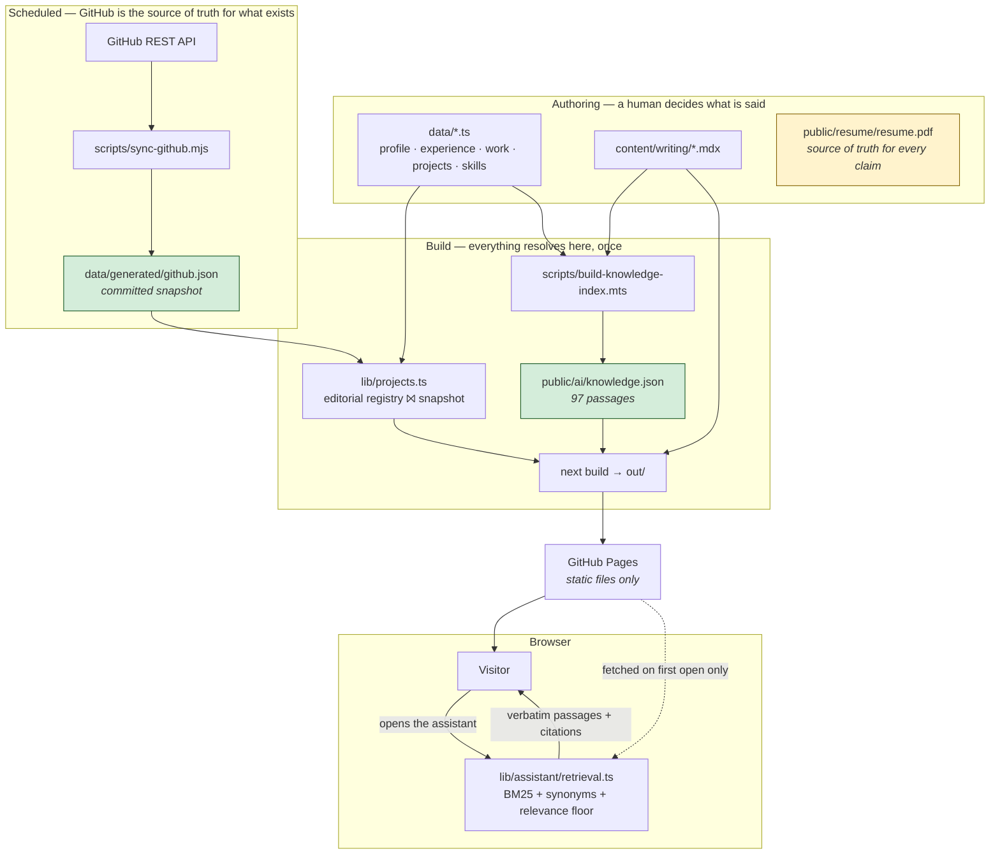
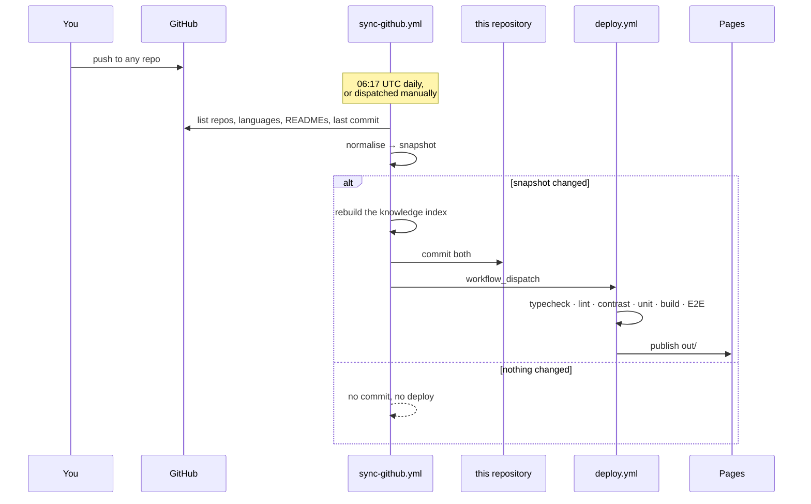
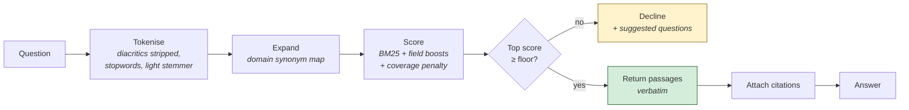

# Architecture

A static site with two build-time data pipelines and one client-side retrieval
engine. There is no server, no database and no runtime API call — deliberately.

---

## 1. The whole system



Everything green is generated and committed. Everything yellow is a source
document. Nothing crosses a network at request time.

---

## 2. Why static

The site could have been a Next.js server on Vercel with API routes, live GitHub
calls and an LLM-backed assistant. It is not, and the reasons are worth stating
because "static" usually means "fewer features" and here it does not.

**A GitHub outage cannot break a deploy.** Repository metadata is fetched by a
scheduled job and committed. If the API is down when a build runs, the build
reads the last good snapshot. The failure mode of the live-API design is a
deploy that ships an empty projects page.

**What shipped is auditable.** `data/generated/github.json` is in git history, so
"what did the site say about this repo in September" is answerable.

**There is no key to leak.** The assistant has no API key because it makes no
model call. There is no contact endpoint to rate-limit because the contact form
composes a `mailto:` rather than posting anywhere.

**It cannot cost money unexpectedly.** No per-request inference, no egress
surprise, no function invocations.

The cost of this choice is real and is stated in §5: the assistant retrieves
rather than reasons.

---

## 3. GitHub synchronisation

### The two layers

| Layer | Owns | Lives in |
|---|---|---|
| **Snapshot** | What exists — names, languages, topics, stars, push dates, READMEs, last commit | `data/generated/github.json` (generated) |
| **Registry** | What is said — which projects appear, in what order, with what narrative and which measured figures | `data/projects.ts` (authored) |

The join in `lib/projects.ts` is deliberately asymmetric:

- **A project whose repo disappears still renders.** It loses live metadata and
  keeps its case study. Renaming a repository on GitHub degrades the page; it
  does not break it.
- **A repo with no registry entry is never shown.** GitHub cannot publish to the
  portfolio on its own. A human decides what appears.

That asymmetry is the whole point of having two layers, and it is enforced by
tests in `tests/unit/projects.test.ts`.

### Private repositories

The snapshot is committed to a **public** repository, so including a private repo
would publish its name, description and topics. `sync-github.mjs` therefore
excludes private repos by default and lists what it skipped. Opting one in is
explicit, per-repo, via `SYNC_INCLUDE_PRIVATE`.

DecisionForge is private and is presented on the site with no repository link for
exactly this reason.

### How an update propagates



A push made with `GITHUB_TOKEN` does not trigger other workflows — GitHub blocks
that recursion — so the sync job dispatches the deploy explicitly rather than
relying on the push.

**To force an update now:** run the *Sync GitHub projects* workflow manually, or
`npm run sync:github && npm run knowledge` locally and commit.

---

## 4. The assistant

### Pipeline



### What makes the grounding claim true

The answer is assembled from three things: a lead sentence chosen from a fixed
set of templates, the retrieved passages **verbatim**, and their source links.
No passage is paraphrased, summarised, or generated. There is no model in the
path — not a hosted one, not a local one.

So the strongest statement that can honestly be made is: **the assistant cannot
state anything that is not already written on this site.** It can still be
wrong in one way — by retrieving a passage that does not answer the question —
and that failure is visible to the reader, because the passage is right there
with its source. That is a different class of failure from a fluent invention.

The index is built from the same `data/*.ts` modules the pages render, so a
sentence that is not on the site cannot be in the index.

### The relevance floor

`SCORE_FLOOR = 3.0`, with matches scaled by `coverage^0.9`. The exponent exists
because BM25 rewards rare terms, which is right for content words and wrong for
incidental ones — a question about hourly rates matched a chunk on the word
"per" alone and cleared the old floor. Scaling close to linearly by how much of
the question a passage covers stops a single lucky term from carrying a match.

Both behaviours are tested: `tests/unit/retrieval.test.ts` asserts that every
advertised question returns something, and that a set of deliberately
out-of-scope questions returns nothing.

### Cost

The index is 91 kB and is fetched **on first open**, never on page load. A
visitor who does not use the assistant pays nothing for it.

---

## 5. Known limitations of this architecture

Stated here rather than discovered later:

- **The assistant retrieves; it does not reason.** It cannot synthesise across
  two passages, answer a comparative question, or rephrase for a lay reader.
  A hosted model would do all three. This was traded for the guarantee that it
  cannot fabricate.
- **Project data is as fresh as the last sync**, which is nightly. A repo pushed
  an hour ago shows yesterday's commit. The GitHub section says when it last
  synced, and says so more loudly once the snapshot is over ten days old.
- **The contact form does not send.** It composes a `mailto:`. If the visitor has
  no mail client configured the flow dead-ends, which is why the email address is
  also shown as plain text and linked directly.
- **Client-side filtering needs JavaScript.** The projects list renders fully
  without it — every project and its link are in the HTML — but the search box
  and filter chips do nothing until hydration.
- **No analytics.** Nothing is measured about visitors, which also means there is
  no data on which projects get read.

---

## 6. Repository layout

```
app/                 routes; every page is statically generated
  projects/          the systems index and case studies
  work/              employment case studies
components/
  architecture/      SystemDiagram — typed data rendered to accessible DOM
  assistant/         provider, trigger, dialog
  projects/          explorer, GitHub activity
  home/ layout/ ui/
data/
  profile.ts         identity, positioning, current focus
  experience.ts      roles — the résumé is the source of truth
  work.ts            employment case studies
  projects.ts        repository-backed systems + hide decisions
  skills.ts certifications.ts publications.ts nav.ts
  generated/         github.json — synced, committed, never hand-edited
lib/
  architecture.ts    diagram types; NodeKind marks the model boundary
  assistant/         types + BM25 retriever
  projects.ts        registry ⨝ snapshot, activity, explorer feed
scripts/
  sync-github.mjs           GitHub → snapshot
  build-knowledge-index.mts data → assistant index
  check-contrast.mjs        WCAG check over the oklch tokens
  serve-out.mjs             static server for the E2E suite
tests/
  unit/              retrieval, registry, diagrams, provenance rules
  e2e/               visitor flows, accessibility, contrast probe
docs/                research, audit, architecture, design system, test report
```

---

## 7. Security posture

| Surface | Position |
|---|---|
| Secrets | None exist. No API key, no token in the client, nothing in `.env` |
| GitHub token | Used only inside Actions, by the sync job, with `GITHUB_TOKEN` |
| Private data | Private repos excluded from the committed snapshot by default |
| Phone number | Deliberately not in the knowledge index; asserted by a unit test |
| User input | The only input is the assistant query, which is tokenised and never evaluated, rendered as HTML, or sent anywhere |
| Third-party JS | None. No analytics, no fonts from a CDN — fonts are self-hosted at build time |
| Prompt injection | Not applicable. There is no prompt and no model |
| `dangerouslySetInnerHTML` | Used only for JSON-LD, built from typed data via `JSON.stringify` |
